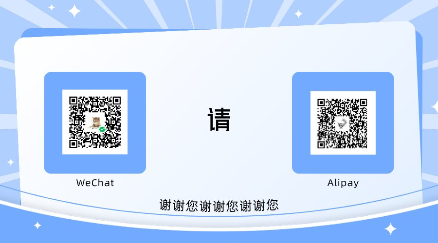

# Sponsorship

If this project saved you money, you are welcome to buy the author a coffee. It is entirely optional, there is no paid tier, no feature is withheld, and nothing here changes based on whether you donate.

## Where the money goes

It offsets the API and electricity cost of the measurements published in [`docs/measurements.md`](measurements.md) — the quota-burning probes, the session-log analysis, and the local model benchmarking.

## Payment

Scan either code — WeChat Pay on the left, Alipay on the right. This is a personal
payment code, not a merchant account, so **no goods, services, support, warranty,
or priority are exchanged for it.** It is a voluntary tip.

Two practical notes:

- **A payment code is a personal credential.** If you are reading this in a fork or
  a mirror, the image may have been replaced; a tip sent to a code that came from
  anywhere other than this repository did not reach the author.
- **No amount is expected.** There is no minimum, no maximum, and no reward tier.
  If you want a receipt, a tip jar cannot give you one.

### 微信 / 支付宝

左边是微信，右边是支付宝，扫任一个即可。这是**个人收款码**，不是商户账户，因此
**不换取任何商品、服务、支持、担保或优先级** —— 纯属自愿打赏。

两点提醒：

- **收款码属于个人凭据。** 如果你是在 fork 或镜像里读到这一页，图片可能已被替换；
  来自本仓库之外的收款码与你看到的作者无关。
- **不期待任何金额。** 没有起捐额、没有上限、也没有回报。如果你需要发票或收据，
  打赏形式无法提供。

## Read this before you send money

**This is a voluntary tip, not a purchase.** No goods, services, support, warranty, or priority are exchanged for it. Nothing in this project is gated behind it, and no feature is withheld from anyone who does not pay.

An earlier version of this page carried a checklist of platform rules for the author to verify — whether a personal payment code may be published, what the daily receiving limit is, and so on. It has been removed. The questions were reasonable, but the answers had not been checked against the providers' own documentation, and a page of unverified compliance advice is worse than none: it invites a reader to rely on it. Payment providers' terms are the authority, and they change.

### For the donor

- **Confirm the QR image came from this repository**, not from a fork or a mirror. A fork can replace it, and a tip sent to a code that did not come from here does not reach the author.
- **Treat a payment request arriving as an issue comment, a pull request, or a direct message as fraud.** This project never solicits.
- **There is no minimum, no maximum, and no reward.** A tip jar cannot give you a receipt.

## Alternatives that cost nothing

- Report a reproduction case for a bug, or a measurement that contradicts one published here. That is worth more than money.
- Tell the project which harness version you run and whether `tools/doctor.mjs` passes on it. That is the data that keeps [`docs/compatibility.md`](compatibility.md) honest.
